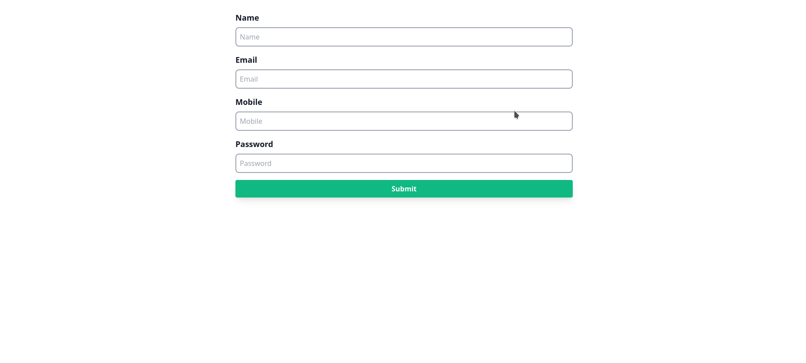
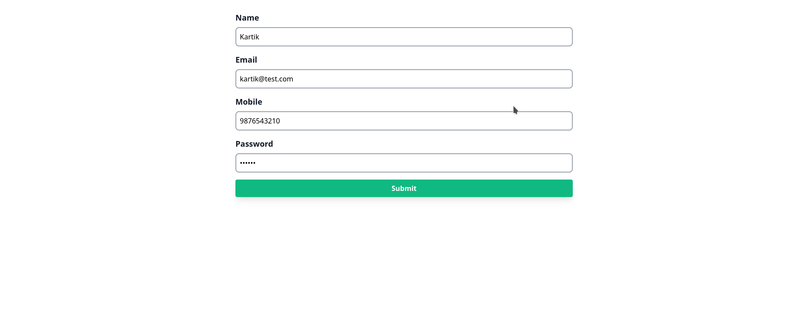

# Aplicación CRUD de PHP

Este repositorio contiene una aplicación PHP CRUD (Create, Read, Update, Delete) simple. Es una demostración básica de cómo integrar PHP con una base de datos MySQL para gestionar datos de usuarios. La aplicación permite a los usuarios agregar, ver, editar y eliminar información de usuario.

## Tecnologías Utilizadas

- **PHP:** Lenguaje de script del lado del servidor utilizado para el desarrollo web.
- **MySQL:** Sistema de gestión de base de datos utilizado para almacenar datos de usuario.
- **HTML & CSS:** Utilizados para estructurar y dar estilo a las páginas web.
- **Tailwind CSS:** Un framework de CSS utilitario para el desarrollo rápido de interfaces de usuario.

## Páginas y Funcionalidades

### 1. Página de Inicio (`display.php`)


- **Funcionalidad:** Muestra todos los usuarios de la base de datos en un formato de tabla.
- **Características:** 
  - Ver todos los usuarios.
  - Enlaces de navegación para agregar, editar o eliminar información de usuario.

### 2. Agregar Usuario (`user.php`)



- **Funcionalidad:** Permite agregar un nuevo usuario a la base de datos.
- **Características:** 
  - Formulario para ingresar detalles del usuario (nombre, correo electrónico, teléfono móvil, contraseña).
  - Validación de datos y envío a la base de datos.

### 3. Editar Usuario (`edit.php`)



- **Funcionalidad:** Permite editar detalles de usuarios existentes.
- **Características:** 
  - Formulario prellenado con la información actual del usuario.
  - Actualización de detalles del usuario en la base de datos.

### 4. Eliminar Usuario (`delete.php`)

- **Funcionalidad:** Facilita la eliminación de un usuario de la base de datos.
- **Características:** 
  - Eliminación de información de usuario basada en el ID de usuario.

## Conexión a la Base de Datos (`connect.php`)

- **Propósito:** Establece una conexión con la base de datos MySQL.
- **Credenciales:** Utiliza nombre de host, nombre de usuario, contraseña y nombre de la base de datos para la conexión.

## Cómo Ejecutar

1. Clona el repositorio en tu máquina local.
2. Configura un entorno PHP y MySQL (como XAMPP).
3. Crea la base de datos usando phpmyadmin.
4. Ejecuta la aplicación en un servidor local.

## Nota de Seguridad

Esta aplicación es una demostración básica y no implementa medidas avanzadas de seguridad. Es recomendable utilizar declaraciones preparadas (prepared statements) u ORM para las interacciones con la base de datos para prevenir ataques de inyección SQL.

---

Siéntete libre de contribuir a este proyecto o sugerir mejoras. Para cualquier consulta o problema, por favor abre un issue en este repositorio.
```

